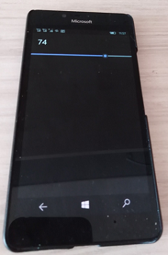
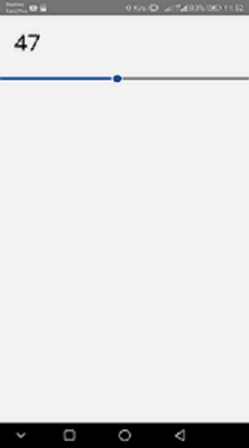
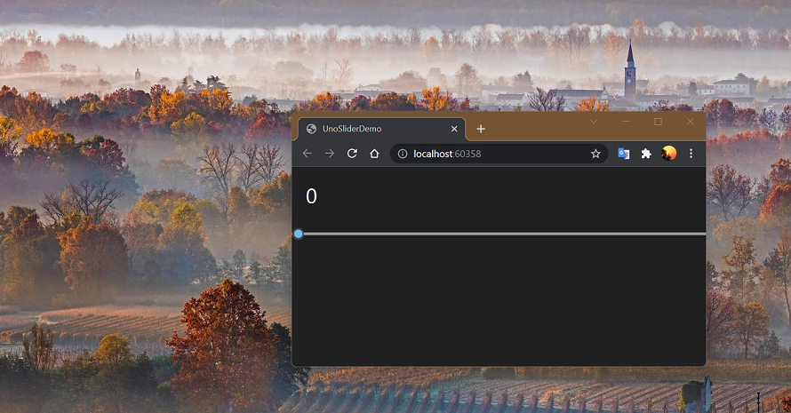

# WPR - uno branch 
Template for future "WPR UNO". Empty project (only slider "stub")

## Screenshots

## Architecture
### [UnoSliderDemo.Shared](Src/UnoSliderDemo.Shared) - Shared part of code
### [UnoSliderDemo.Droid](Src/UnoSliderDemo.Droid) - Android part of code
### [UnoSliderDemo.UWP](Src/UnoSliderDemo.UWP) - "Universal" (Win10/Mobile) part of code
### [UnoSliderDemo.iOS](Src/UnoSliderDemo.iOS) - iOS part of code
### [UnoSliderDemo.macOS](Src/UnoSliderDemo.macOS) - MacOS part of code
### [UnoSliderDemo.Wasm](Src/UnoSliderDemo.Wasm) - "Web" part of code....

## Install&Dev fast intro
* Install newest Visual Studio 2022 Preview 
* Install .NET, Xamarin, Web dev. workloads
* Find and install .NET 5 and .NET Core 5 (optional, only if You interesting in WASM) 
* Install UNO Platform extension
   

## Changelog
### v1.0.*

## TODO
- Do test builds (conditional framework's builds according to platform specifics).
- Try to inject "WPR kernel" from original WPR (https://github.com/8212369/WPR)'s "zero commit"... 
- Realize another "multi-platform WPR-world"... =)
  
Provide a sample application.

# Contribute!
There's still a TON of things missing from this proof-of-concept (MVP) and areas of improvement 
which I just haven't had the time to get to yet.
- UI Improvements (for GTK, for example, or for each one of supported mutli-platforms)))
- New features (toasts, etc..))
- Additional Language Packages
- Media Transferring Support: screenshots, etc. (for the brave)

## License
MIT License - see the [LICENSE](LICENSE) file for details.

## .
As is. No support. For geeks / devs only! DIY.

## ..
With best wishes,

  [m][e] 2025

